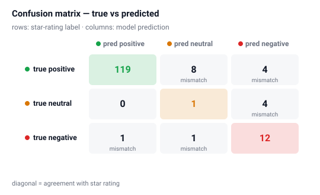
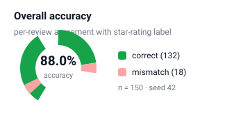
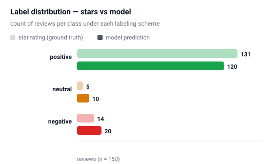
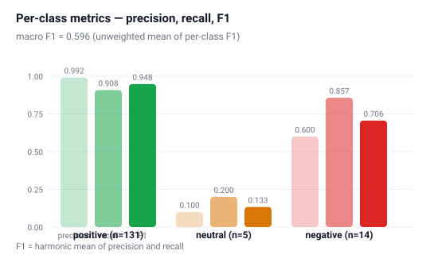

# Sam's Workspace

LLM sentiment classifier for Amazon Gift Card reviews — **3-class (positive / neutral / negative)**,
driven by an OpenAI-compatible LLM endpoint, with an interactive results dashboard.

[](https://sdrew404.github.io/Sams-Workspace/)
[](https://sdrew404.github.io/Sams-Workspace/)
[](https://sdrew404.github.io/Sams-Workspace/)
[](https://sdrew404.github.io/Sams-Workspace/)
[]()

---

## ▶️ Interactive dashboard — [try it live](https://sdrew404.github.io/Sams-Workspace/)

Click through all 150 sampled reviews: filter by predicted / true label, star rating or
agreement; full-text search; expand any review to see the raw model answer; and record
**your own judgment** (agree / disagree + notes) to sense-check the model review by review.

Preview of the landing page (rendered from this repo by GitHub Pages):

| | |
|---|---|
| **Results overview** | **Accuracy split** |
|  |  |

## Results

**88.0% accuracy** (132/150) vs. the star-rating label · macro F1 **0.596**

| class | n | precision | recall | F1 |
|---|---:|---:|---:|---:|
| positive | 131 | 0.992 | 0.908 | **0.948** |
| neutral | 5 | 0.100 | 0.200 | 0.133 |
| negative | 14 | 0.600 | 0.857 | 0.706 |

<div align="center">


</div>

> ⚠️ n=5 for neutral and n=14 for negative: per-class numbers on those buckets are
> statistically noisy — this is a consequence of pure random sampling from a ≈87% positive corpus.

## Where the model "disagrees" with the stars

Most mismatches are **star-rating vs. text sentiment** conflicts, not model errors —
the model reads the *text*, the stars only summarize it:

| stars | title | model | why it's interesting |
|---:|---|---|---|
| 4★ | "Watch what you are buying" | negative | text: *"Product was not what I expected… Lesson learned"* — text clearly negative despite 4 stars |
| 1★ | "Perfectly usable for me." | positive | text: *"No dislike for this…"* — text is positive despite 1 star |
| 5★ | "Gift card" | neutral | text: *"Gift card"* / *"N/A"* — no sentiment expressed at all |
| 5★ | "Reloads instantly" | negative | text: *"Reloads instantly, but… the $10 promotion… that I didn't receive"* — frustrated despite 5 stars |
| 4★ | "Nice gift card" | negative | text: *"…you see a barcode not Merry Christmas"* — design complaint in an otherwise positive review |
| 1★ | "Not sure" | neutral | text: *"I don't think I ever bought gift card"* — no clear polarity |

## Data & method

- **Data:** [Amazon Reviews 2023](https://cseweb.ucsd.edu/~jmcauley/datasets/amazon_v2/) (McAuley Lab, UCSD) — Gift Cards category, **152,410 reviews** (`data/Gift_Cards.jsonl.gz`, not committed — ~12 MB).
- **Sample:** 150 reviews, pure random, `seed=42`.
- **Ground truth:** star rating → 1–2 ★ = negative, 3 ★ = neutral, 4–5 ★ = positive.
- **Model:** OpenAI-compatible course endpoint (`DeepSeek-V4-Flash-0731`, a reasoning model — needs `max_tokens ≥ 512`; with tiny budgets it emits chain-of-thought and returns `content=None`), temperature 0, single-word answer contract, one constrained retry on unparseable output.
- **Metrics:** accuracy, macro-F1, per-class precision/recall/F1, confusion matrix (pure Python, no sklearn).

## Repo layout

```
├── sentiment_classifier.py   # CLI: sample → classify → evaluate → CSV
├── generate_dashboard.py     # builds dashboard.html (self-contained, 150 reviews embedded)
├── generate_charts.py        # builds charts/*.svg for this README
├── dashboard.html            # interactive results dashboard
├── index.html                # Pages root → redirects to dashboard.html
├── charts/                   # SVG charts shown above
├── results/                  # generated CSVs (gitignored)
└── data/                     # dataset (gitignored — download separately)
```

## Usage

```bash
# setup (Python 3.11)
uv venv .venv && uv pip install --python .venv/bin/python openai pyyaml

# classify a fresh sample and write results/sampled_reviews.csv
.venv/bin/python sentiment_classifier.py --samples 150 --seed 42 --workers 8

# regenerate the dashboard + charts
.venv/bin/python generate_dashboard.py
.venv/bin/python generate_charts.py
```

**Endpoint configuration** — the script reads `OPENAI_BASE_URL` / `OPENAI_API_KEY` from the
environment, falling back to `~/.hermes/config.yaml` (never committed, never printed).
